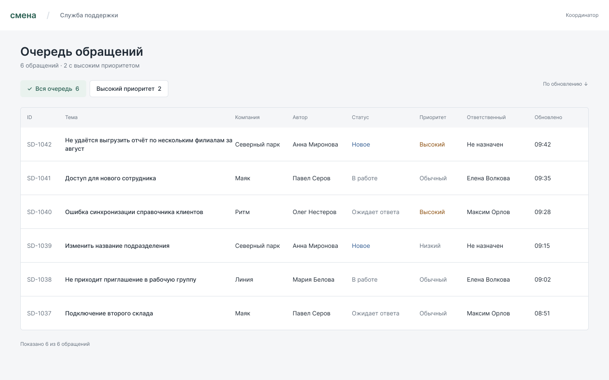
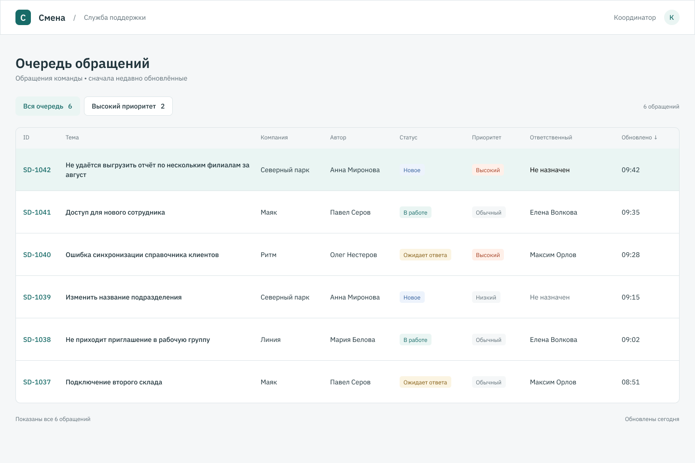
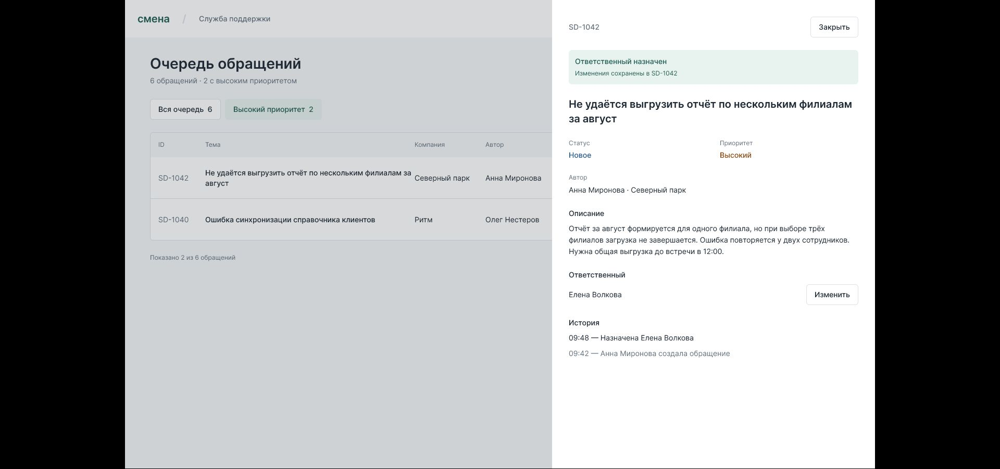
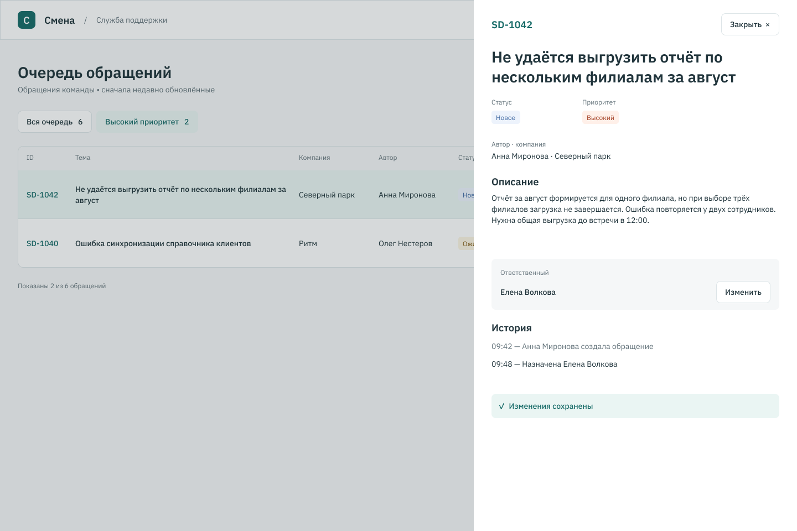
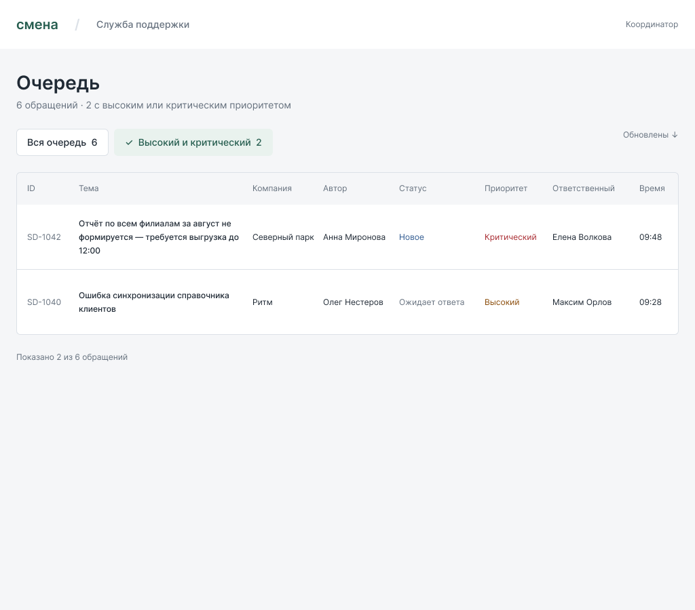
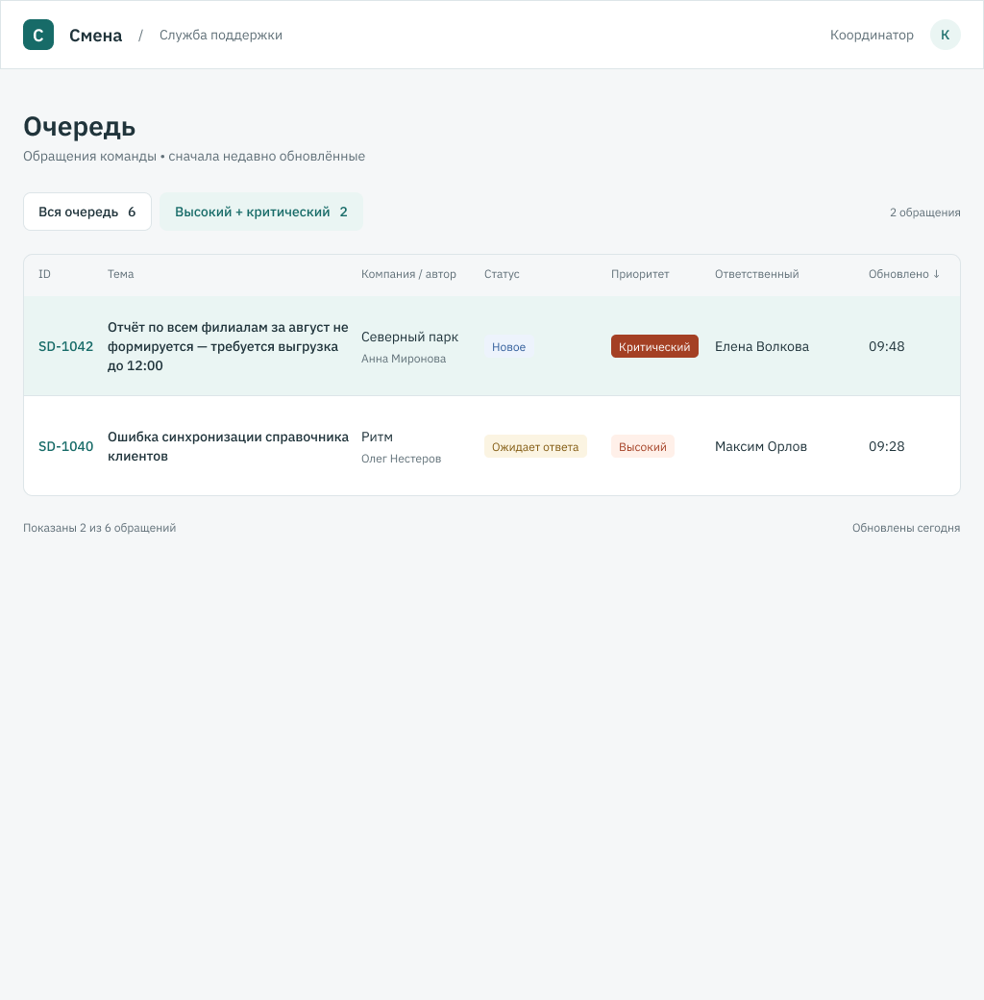

# Очередь поддержки: 01 и 02

Одна задача и одинаковые исходные данные. Здесь показаны первые версии до
изменения требований. Условия использования навыков в этом файле не раскрыты.
Выбор пользователя пока не получен.

## Вся очередь

### 01

### 02

## Назначение сохранено

### 01

Снимок player, панель поверх отфильтрованной очереди:

### 02

Экспорт составного Figma-экрана, панель поверх отфильтрованной очереди:

Источники различаются: первая картинка снята в player, вторая экспортирована
из Figma. Обе показывают назначение Елены в отфильтрованной очереди.

## После одинаковой правки: ширина 1024

Новая тема SD-1042, критический приоритет, сохранённая Елена и две строки
в фильтре. Оба изображения — экспорты финальных авторских экранов.

### 01

[Пройти вариант 01](https://www.figma.com/proto/syIgLpxmKDpU4XKFYJcrMK?node-id=23-163&starting-point-node-id=23%3A163&scaling=scale-down).

### 02

[Пройти вариант 02](https://www.figma.com/proto/Nh4qfiqCkexl4JYunWkbw4?node-id=19-684&starting-point-node-id=19%3A684&scaling=scale-down).

Какой оставил бы для дальнейшей работы: 01 или 02? Что поправил бы первым?
