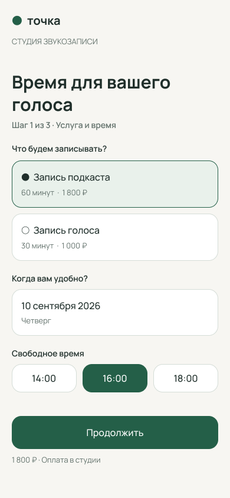
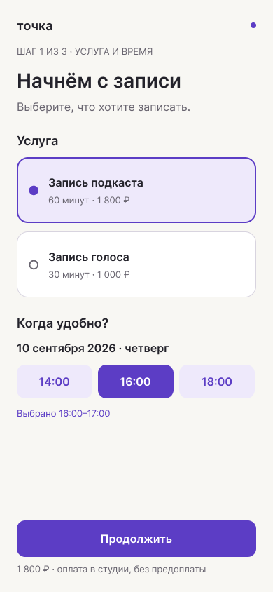
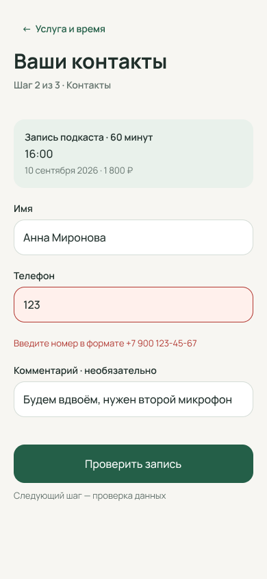
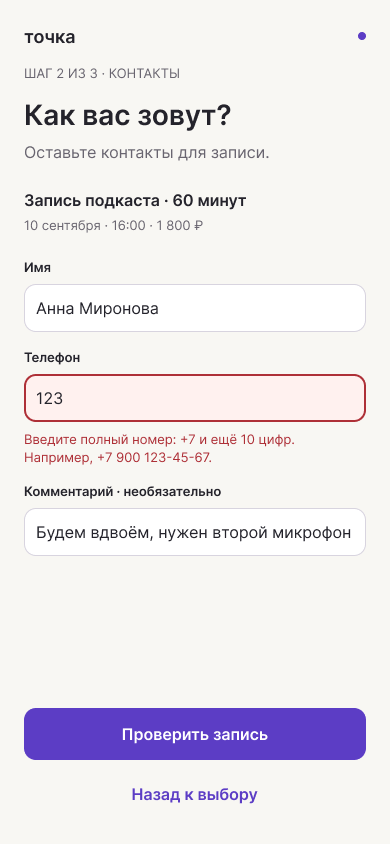
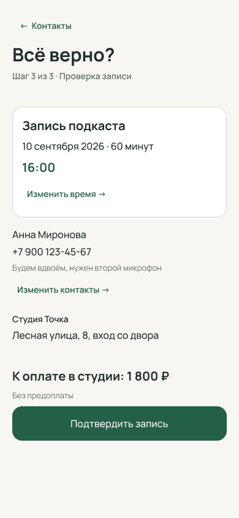
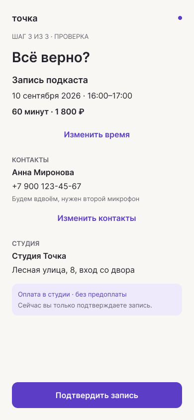
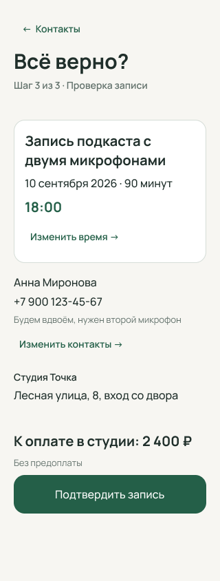
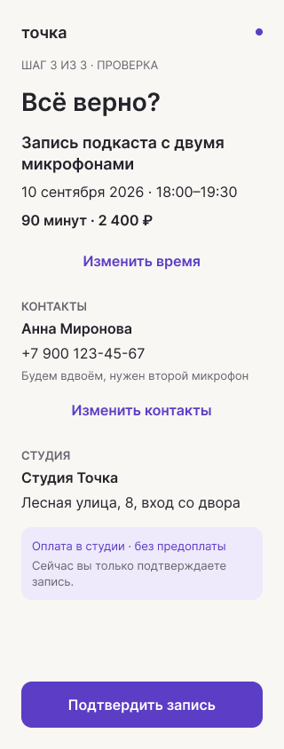

# Запись в студию: 01 и 02

Одна задача и одинаковые исходные данные. Ниже первые версии, до изменения
услуги и доступного времени. Условия использования навыков здесь не раскрыты.
Выбор пользователя пока не получен.

## Выбрать услугу и время

### 01

### 02

## Исправить телефон

### 01

### 02

## Проверить запись

### 01

### 02

Это экспорты отдельных Figma-экранов. Они позволяют сравнить композицию,
но не заменяют прохождение переходов в прототипе.

## После одинаковой правки: проверка записи в 320 px

Подкаст переименован, длительность 90 минут, стоимость 2 400 ₽. После потери
16:00 выбрано 18:00; контакты сохранены. Оба изображения — финальные экспорты.

### 01

[Пройти сценарий 01](https://www.figma.com/proto/RegefZg97UJIuwHnhmeQnv?node-id=4-27&starting-point-node-id=4%3A27&scaling=scale-down).

### 02

[Пройти сценарий 02](https://www.figma.com/proto/RyTcQoqcgZ8HadH8IpzGgB?node-id=26-201&starting-point-node-id=26%3A201&scaling=scale-down).

Какой оставил бы для дальнейшей работы: 01 или 02? Что поправил бы первым?
