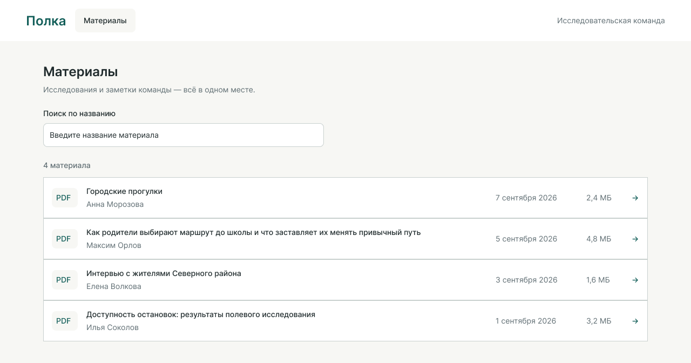
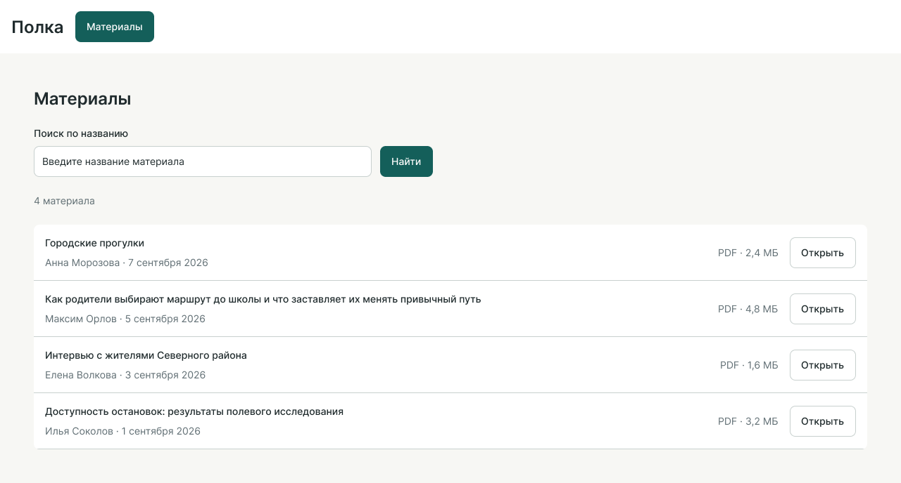
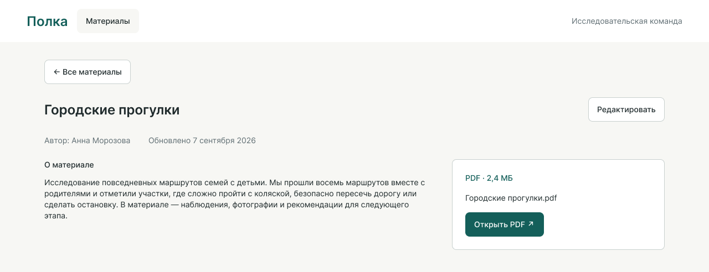
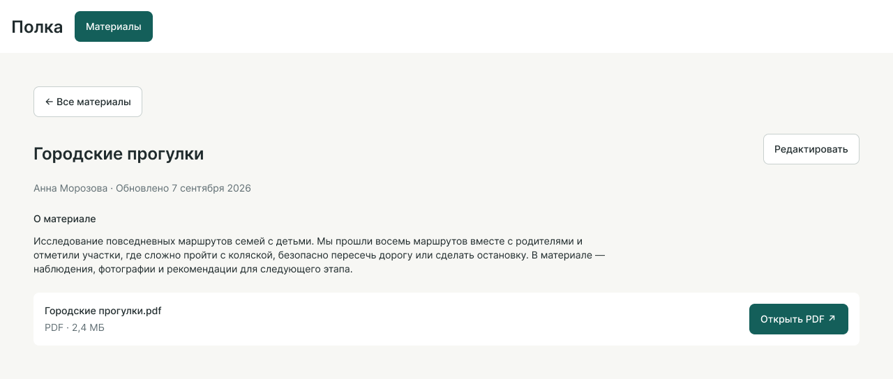
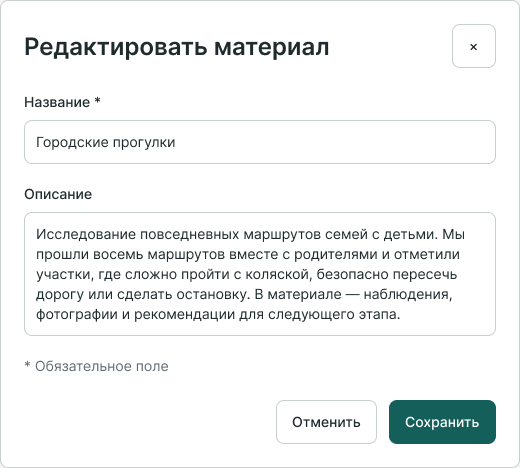
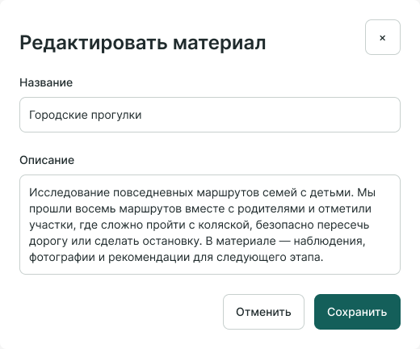
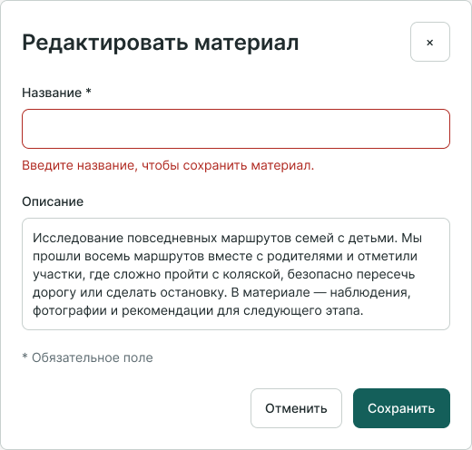
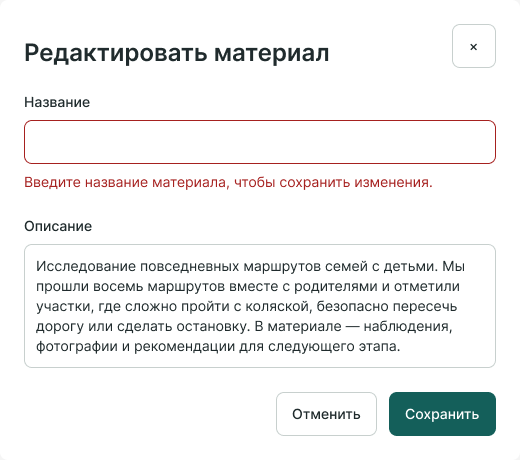
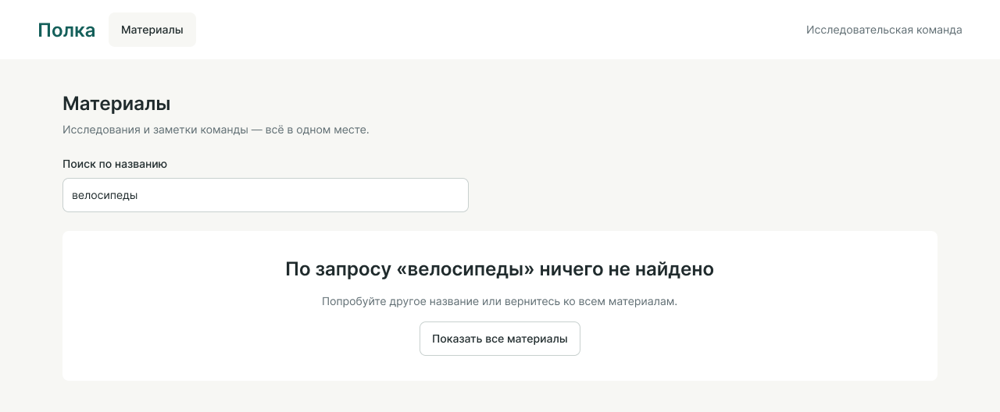
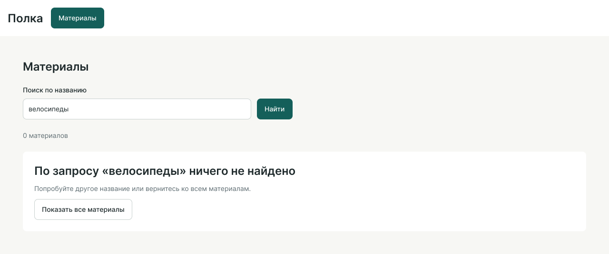

# Полка: варианты A и B

Ниже — сохранённые исходные версии одной задачи, показанные пользователю под нейтральными обозначениями. Пользователь выбрал B. Условия, последующая ревизия и независимые проверки раскрыты в [результатах](results.md).

Живые файлы содержат последующую ревизию; эти снимки сохраняют первую сдачу.

## 1. Найти материал

**A**

**B**

## 2. Прочитать описание

**A**

**B**

## 3. Отредактировать

| A | B |
|---|---|
|  |  |

## 4. Исправить ошибку

| A | B |
|---|---|
|  |  |

## 5. Вернуться из пустого поиска

**A**

**B**

В обоих вариантах используются одинаковые исходные данные, палитра и стартовые компоненты. Поиск и редактирование представлены фиксированными состояниями Figma, а не работающим приложением.
