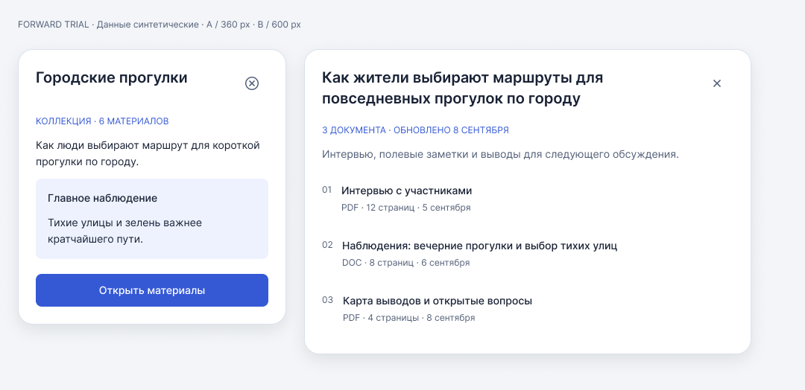

# Результат первого применения — 2026-09-08

**Черновик работоспособен в ограниченном срезе.** Независимый от автора навыка
агент построил новый ReviewPanel без истории Haulplane; root проверил код
проверки, конечный макет и выполнил отдельное публичное редактирование.

[Figma-проба](https://www.figma.com/design/w9Pl9kkKD79ASwzqFBYNx6?node-id=3-17)
· [Отчёт исполнителя](trial-2026-09-08/report.md)
· [Уточнения навыка](skill-iteration.md)



## Что фактически проверено

| Область | Результат |
|---|---|
| Формат навыка и доступность его ссылок | PASS; штатный валидатор и локальная проверка |
| Новое применение без истории автора | Выполнено отдельным агентом; одна ограниченная задача, не A/B benchmark |
| Структура | Два INSTANCE одного master, native Body/Footer, TEXT Title и INSTANCE_SWAP Close icon |
| Независимость | Разные тексты, иконки и состав Body; локальная правка не меняет соседние свойства/содержимое |
| Размеры | На тех же instances выполнен переход 360↔600; длинный текст переносится, высота меняется по содержимому |
| Общее изменение | Radius 16→20 и header gap 12→16 распространились на оба instance; локальные настройки сохранены |
| Скрытый Footer | После master edit показан тот же custom footer, с теми же child/text IDs и строкой; затем снова скрыт |
| Негативный контроль | Реально очищенный в Figma заголовок отвергается именно как `a: local title lost`; исправленный self-test проходит |
| Root как дополнительный потребитель | Через публичные свойства изменил title, icon и ширину A; B остался прежним; после восстановления сверены все свойства, размеры и видимые тексты обоих |
| Визуальный просмотр root | Контекстный снимок 1080×524: оба наполнения читаются, close не перекрывает заголовок, нет обрезанной тени; дополнительно просмотрен снимок длинного наполнения при 360 |

Текущие A/B: 360×370 и 600×410. Close находится в горизонтальном Header,
рисунок геометрически центрирован в своей области 44×44. Оба родительских
контейнера имеют `clipsContent=false`. Подробности —
[root-inspection.json](root-inspection.json) и
[root-final-check-result.json](root-final-check-result.json).

## Покрытие каталога

LD-02, LD-12, LD-15 проверены в рамках этой панели; LD-08 получил ограниченное
свидетельство common/local edit. LD-01 проверен частично: пустые native slots и
сохранение custom Footer при hide/show; отдельный fallback здесь не обещан.
LD-13 проверен частично на тени родителя, не на focus ring Button. Негативный
контроль подтверждает обнаружение потери заголовка, но не весь LD-04 с ошибкой
reference только в одном варианте. Остальные случаи **not run**.

## Найдено и исправлено

- Пустой slot сохранял 100 px; в текущем канале уменьшен до 0.01 px. Остаток
  0.02 px у двух пустых slots честно указан, literal-zero PASS не заявлен.
- Скрытый Footer не находился обходом: проверен штатный show/edit/hide.
- Родитель обрезал тень: исправлен его clipping и переснят тот же контекст.
- Root обнаружил, что отрицательная ветка checker безусловно падала. Исправлена
  проверка причины отказа, добавлена проверка конечного восстановленного состояния.

По результатам уточнены две инструкции: причина отрицательного результата
и диагностика скрытого содержимого. Новый полный слепой прогон уже уточнённого
навыка не выполнялся; исправленный checker и конечное состояние проверены повторно.

## Как повторить локальные проверки

Из корня репозитория, обычным Python без внешних пакетов:

```powershell
python -X utf8 evals/trial-2026-09-08/check_trial.py good
python -X utf8 evals/trial-2026-09-08/check_trial.py bad
```

Первый вызов должен завершиться с кодом 0, второй — с кодом 1 и сообщением
`a: local title lost`. Good-режим сам проверяет точную причину отказа bad fixture.
Эти команды повторно проверяют сохранённые результаты настоящих Figma-операций;
они не обращаются к живому файлу. `.js` — журнал выполненных операций с
точными IDs, а не идемпотентный генератор: не запускай весь журнал повторно
в готовом файле. Для нового live-прогона возьми brief и отдельный файл.

## Оставшиеся границы

Визуальное направление не принято владельцем. Не проверялись реальные
пользователи, runtime/клавиатура, все состояния, publication/import, token
roundtrip, Code Connect и реализация Vue/Storybook. Ни количество узлов,
ни эта одна проба не подтверждают универсальность или измеренную экономию.
